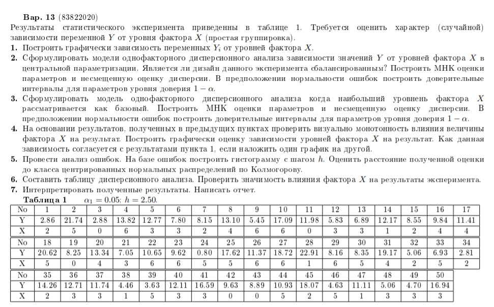

## Вариант 13

### Постановка задачи



### Ход решения

#### 1. Построить графически зависимость переменных Yi  от уровней фактора X.

```{r}
x = c(2, 5, 0, 6, 3, 3, 2, 4, 6, 6, 0, 3, 3, 1, 2, 4, 4, 5, 0, 4, 3, 6, 6, 5, 5, 6, 6, 1, 6, 5, 4, 2, 5, 2, 2, 3, 3, 1, 5, 3, 3, 0, 0, 5, 2, 5, 1, 3, 3, 3)
y = c(2.86, 21.74, 2.88, 13.82, 12.77, 7.80, 8.15, 13.10, 5.45, 17.09, 11.98, 5.83, 6.89, 12.17, 8.55, 9.84, 11.41, 20.62, 8.25, 13.34, 7.05, 10.65, 9.62, 0.80, 17.62, 11.37, 18.72, 22.91, 8.16, 8.35, 19.17, 5.06, 6.93, 2.81, 14.26, 12.71, 11.74, 4.46, 3.63, 12.11, 16.59, 9.63, 8.89, 10.93, 18.07, 4.63, 11.11, 5.06, 4.70, 16.94)
n = length(x)
plot(x, y)
```

По уровням факторов:

```{r}
plot(factor(x), y)
```

#### 2. Сформулировать модели однофакторного дисперсионного анализа зависимости значений Y от уровней фактора X в центральной параметризации. Является ли дизайн данного эксперимента сбалансированным? Построить МНК оценки параметров и несмещенную оценку дисперсии. В предположении нормальности ошибок построить доверительные интервалы для параметров уровня доверия 1-α.

Модель будет иметь вид: $y_i=μ+β_i^X+ε_i$, где μ – взвешенное среднее, $β_i^X$ – главные эффекты фактора Х, $ε_i$  - отклонения.

```{r} 
table(x)
```

Видно, что дизайн не сбалансирован.

```{r results="hide"}
dat = data.frame(y=y, x=x)
dat1 = dat[order(x),]

lev = levels(as.factor(x))
n.lev = length(lev)
Y = as.matrix(dat1$y)
X = matrix(0, nrow = n.lev, ncol = n)
for (i in 1:n)
  X[dat1$x[i]+1, i] = 1
S = X %*% t(X)
S1 = solve(S)
bhat = S1 %*% X %*% Y

v = as.matrix(array(1/n.lev, dim=n.lev))
mu = matrix(t(v) %*% bhat, nrow = n.lev, ncol = 1)
ahat = bhat - mu
res = Y - t(X) %*% as.matrix(bhat)
SS = sum(res^2)
s2 = SS / (n - n.lev)
```

Взвешенное среднее: `r mu[1]`

Главные эффекты:

```{r}
ahat
```

**Найдем ДИ**

```{r results="hide"}
CTR = diag(1, n.lev) - matrix(v, nrow = n.lev, ncol = n.lev)
C0 = as.matrix(v)
muhat = t(C0) %*% bhat
V.mu = t(C0) %*% S1 %*% C0
ahat = t(CTR) %*% bhat
V.a = t(CTR) %*% S1 %*% CTR
V = diag(V.a)
al = 0.05
xa = qt(1 - al/2, n - n.lev)
s1 = sqrt(s2)
d0 = xa * s1 * sqrt(V.mu)
d = xa * s1 * sqrt(V)
```

ДИ для взвешенного среднего: 

```{r}
data.frame(cntr = muhat, lw = muhat-d0, up = muhat+d0)
```

ДИ для главных эффектов:

```{r}
data.frame(cntr = ahat, lw = ahat-d, up = ahat+d)
```

#### 3. Сформулировать  модель  однофакторного  дисперсионного  анализа,  когда  наибольший  уровень  фактора X рассматривается как базовый. Построить МНК оценки параметров и несмещенную оценку дисперсии. В предположении нормальности ошибок построить доверительные интервалы для параметров уровня доверия 1.

Зададим базовым уровень наибольший, т.е. X=7. Тогда модель будет иметь вид $y_i=β_7^X+β_i+ε_i$

```{r results='hide'}
v = c(array(0,dim=n.lev-1),1)
CTR = diag(1,n.lev-1)
CTR = t(cbind(CTR,-as.matrix(array(1,dim=n.lev-1))))
C0 = as.matrix(v)
muhat = t(C0)%*%bhat
V.mu<-t(C0)%*%S1%*%C0
ahat<-t(CTR)%*%bhat
V.a<-t(CTR)%*%S1%*%CTR
V<-diag(V.a)
xa<-qt(1-al/2,n-2)
s1<-sqrt(s2)
d0<-xa*s1*sqrt(V.mu)
CI0<-data.frame(parameter="mu",cntr=muhat,lw=muhat-d0,up=muhat+d0)
d<-xa*s1*sqrt(V)
nm<-paste0("a",c(1:(n.lev-1)))
CI<-data.frame(parameter=nm,cntr=ahat,lw=ahat-d,up=ahat+d)
CI1<-rbind(CI0,CI)
```

Главные эффекты:

```{r}
ahat
```

Взвешенное среднее:

```{r}
muhat
```

Несмещенная оценка дисперсии не изменится.

ДИ для взвешенного среднего и главных эффектов:

```{r}
CI1
```

#### 4. На основании результатов, полученных в предыдущих пунктах проверить визуально монотонность влияния величины фактора X на результат. Построить графически оценку зависимости уровней фактора X на результат. Как данная зависимость согласуется с результатами пункта 1, если наложить один график на другой.

```{r}
plot(x, y)
points(levels(as.factor(x)), bhat, type="o", col="red")
```

Визуально заметно, что величина фактора не влияет монотонно на результат.

#### 5. Провести анализ ошибок. На базе ошибок построить гистограмму с шагом h. Оценить расстояние полученной оценки до класса центрированных нормальных распределений по Колмогорову.

```{r}
hh<-hist(res,breaks=seq(from=-10, to=15, by=2.5))

kolm.stat<-function(s){
  sres<-sort(res)
  fdistr<-pnorm(sres,0,s)
  max(abs(c(0:(n-1))/n-fdistr),abs(c(1:n)/n-fdistr))
}
ks.dist<-nlm(kolm.stat,p=sqrt(s2))$minimum
plot.ecdf(res)
x2<-c(0:1000)*(max(res)-min(res))/1000+min(res)
y2<-pnorm(x2,0,nlm(kolm.stat,p=sqrt(s2))$estimate)
points(x2,y2,"l",col="red",lwd=2)
```

Расстояние полученной оценки до класса нормальных распределений  по Колмогорову

```{r}
ks.dist
```

#### 6. Составить таблицу дисперсионного анализа. Проверить значимость влияния фактора X на результаты эксперимента.

```{r}
X = as.factor(x)
anova(lm(y ~ X))
```

Полученные внутригрупповые дисперсии можно сравнить с помощью F-критерия, проверяющего, действительно ли отношение дисперсий значимо больше 1. В нашем случае F-критерий показывает, что различие между средними статистически значимо, и влияние фактора Х на результаты незначительно.